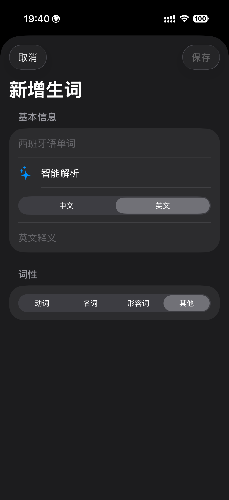
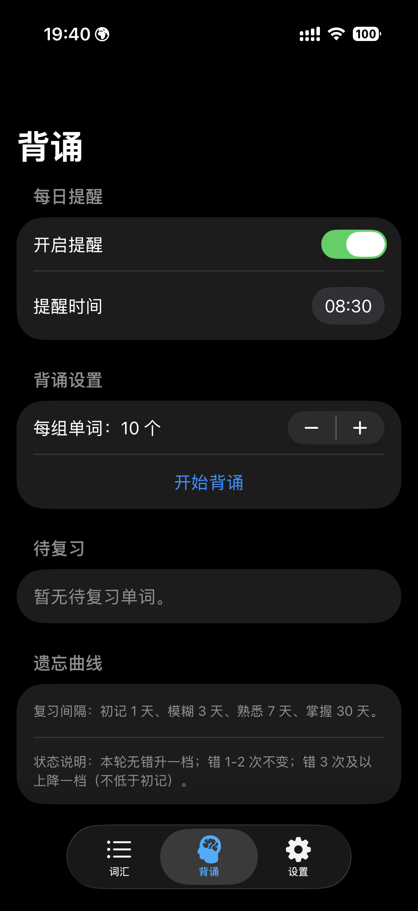

# Spain

西班牙语单词背诵 App，包含词汇管理、动词变位/名词复数/形容词变化、艾宾浩斯复习、每日提醒与数据导入导出等功能。

## 功能概览
- 词汇列表：搜索西语/变形/释义，按掌握状态筛选
- 词汇录入：仅需西语即可保存，支持动词变位、名词复数、形容词四格
- 记忆技巧：自动生成中文 Tips，显示在背诵反馈与词条详情，可手动编辑
- 一键更新：支持全量/已选词智能解析、记忆技巧批量更新
- 背诵模式：选择题 + 默写，三轮完成，按表现升降记忆档位
- 复习提醒：每天固定时间提醒
- 数据管理：导入/导出 JSON 备份
- 显示设置：英文释义字体可切换（当前字体 / Times New Roman）

## 截图与说明
### 词汇

- 顶部搜索：支持西语原型/变形/释义检索
- 状态筛选：按未开始/初记/模糊/熟悉/掌握过滤，并显示数量
- 列表项：展示词性、掌握状态、下次复习时间
- 一键更新：支持全量/已选词更新智能解析或记忆技巧
- 右下角加号：新增单词

### 新增

- 智能解析：自动识别词性、原型与变形
- 记忆技巧：支持生成中文 Tips，可手动调整
- 释义语言：中文/英文切换
- 词性选择：动词/名词/形容词/其他，并录入对应变化
- 保存：仅需西语即可保存（重复会提示）

### 背诵

- 每日提醒：设置固定时间复习
- 每组单词：可调背诵数量
- 开始背诵：三轮训练（西译中/中译西/默写）
- 反馈提示：选项/填空正确或错误高亮，填空错误会显示正确答案
- 记忆技巧：背诵后展示中文 Tips
- 状态规则：按错误次数升降档位

### 设置

- 模型选择：切换 Qwen 模型
- API Key：保存/清除（本地 Keychain）
- 英语字体：San Francisco / Times New Roman
- 数据管理：导入/导出备份

## 构建运行
1) 使用 Xcode 打开 `Spain.xcodeproj`
2) 选择模拟器或真机
3) Run 运行

## API Key（可选）
如需使用智能解析，进入“设置”填写千问大模型的 API Key 即可。可在 [百炼控制台](https://bailian.console.aliyun.com) 注册获取。未填写也可手动录入词汇。

## 数据备份
设置页提供“导出数据 / 导入数据”，用于备份或迁移词库。
